# E-Commerce Store

A full-stack e-commerce web application built using the MERN stack with modern features like JWT authentication, AI-powered product descriptions, Redis caching, product filtering, shopping cart functionality, and responsive UI.

## Live Demo

🔗 Live Website: https://ecommerce-store-nu-pied.vercel.app/

## GitHub Repository

🔗 Repository: https://github.com/vishalpohar/ecommerce-store

---

## Features

* User Authentication & Authorization using JWT
* Product Search and Filtering
* Shopping Cart Functionality
* Responsive UI Design
* RESTful API Integration
* AI-Powered Product Description Generation using Gemini API
* Redis Caching for Performance Optimization
* Image Upload & Management
* Lazy Loading and Frontend Optimization
* API Testing with Postman
* Deployment using Vercel and Render

---

## Tech Stack

### Frontend

* React.js
* Tailwind CSS
* Axios
* React Router DOM

### Backend

* Node.js
* Express.js
* JWT Authentication
* REST APIs

### Database & Caching

* MongoDB
* Redis

### Other Tools & Services

* Gemini API
* Cloudinary
* Postman
* Vercel
* Render
* Git & GitHub

---

## Screenshots

### Home Carousel
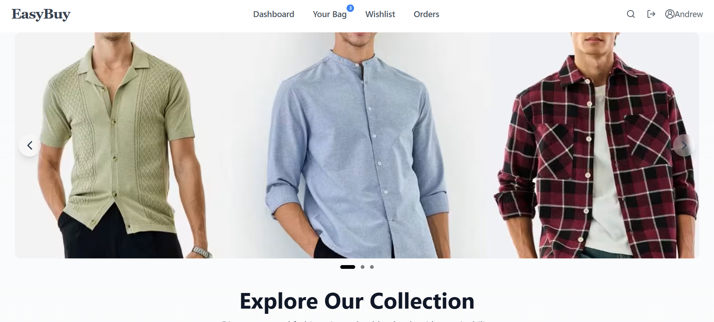

### Home Collections


### Home Featured Products
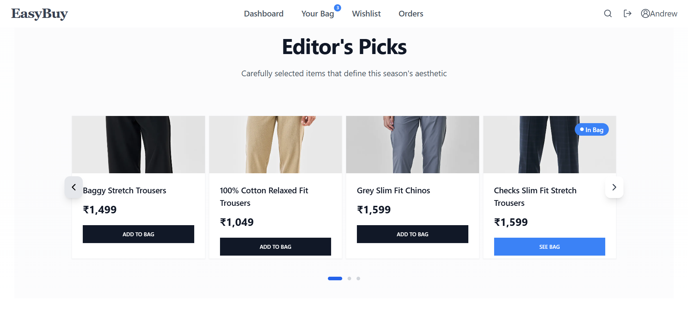

### Product Form
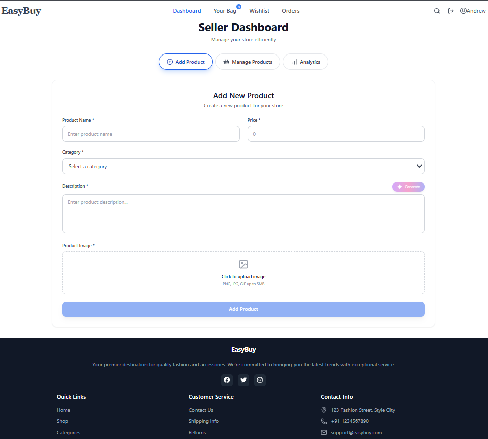

### Product List


### Category Page
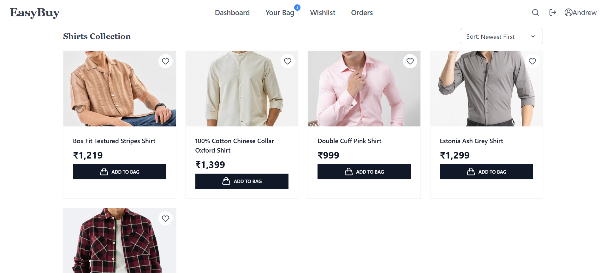

### Frequently Bought
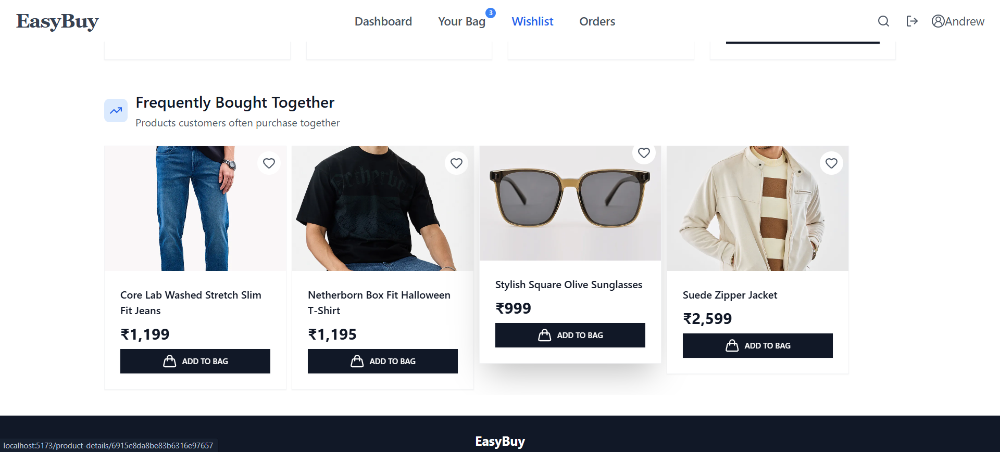

### Analytics
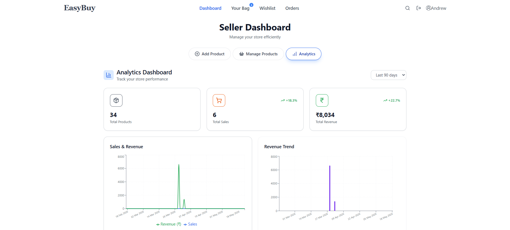

### Wishlist Page
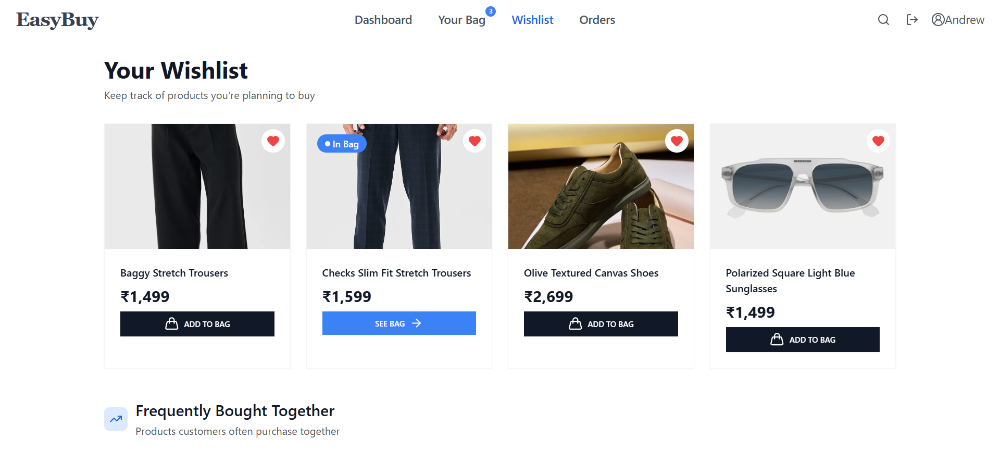

### Cart Page
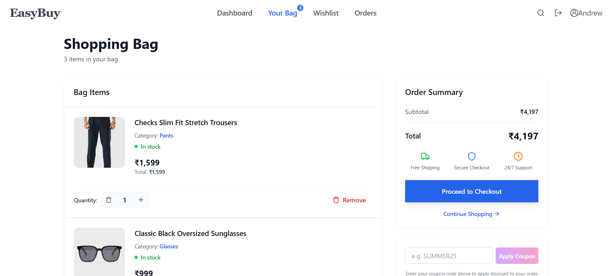

### MyOrders Page
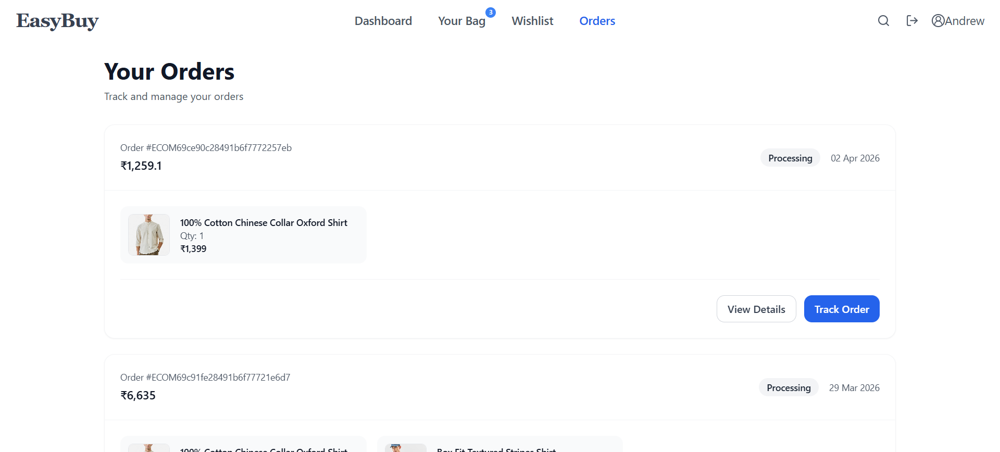

### Order Success Page
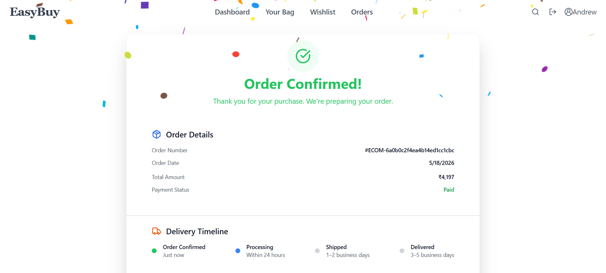

### Payment Cancelled Page
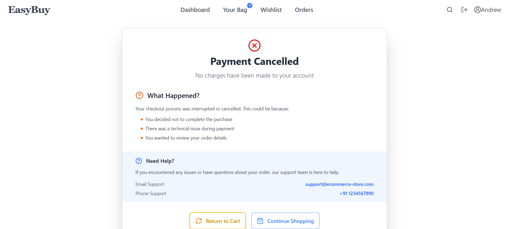

---

## Installation & Setup

### Clone the Repository

```bash
git clone https://github.com/vishalpohar/ecommerce-store.git
cd ecommerce-store
```

### Install Dependencies

### Frontend

```bash
cd client
npm install
```

### Backend

```bash
cd server
npm install
```

---

## Environment Variables

Create a `.env` file in the backend directory and add the following:

```env
PORT=5000
MONGO_URI=your_mongodb_connection
JWT_SECRET=your_jwt_secret
UPSTASH_REDIS_URL=your_redis_url
UPSTASH_REDIS_TOKEN=your_redis_token
ACCESS_TOKEN_SECRET=your_secret_key
REFRESH_TOKEN_SECRET=your_secret_key
STRIPE_SECRET_KEY=your_stripe_key
CLIENT_URL=http://localhost:5173
EMAIL_USER=your_email
EMAIL_PASS=your_app_password
CLOUDINARY_CLOUD_NAME=your_cloud_name
CLOUDINARY_API_KEY=your_api_key
CLOUDINARY_API_SECRET=your_api_secret
GEMINI_API_KEY=your_gemini_api_key
NODE_ENV=development
```

Create a `.env` file in the frontend directory and add the following:

```env
VITE_STRIPE_PK=your_stripe_key
VITE_API_URL=http://localhost:5000/api
```

---

## Run the Application

### Start Backend

```bash
npm run dev
```

### Start Frontend

```bash
npm run dev
```

---

## API Testing

APIs were tested using Postman to ensure:

* Proper request handling
* Authentication validation
* Error handling
* Response optimization

---

## Performance Optimizations

* Implemented Redis caching
* Lazy loading for improved frontend performance
* Optimized MongoDB queries
* Image optimization techniques

---

## Author

### Vishal Pohar

* GitHub: https://github.com/vishalpohar
* Email: [vishalpohar11@gmail.com](mailto:vishalpohar11@gmail.com)

